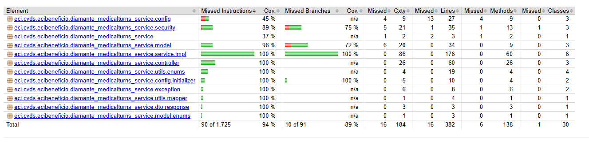
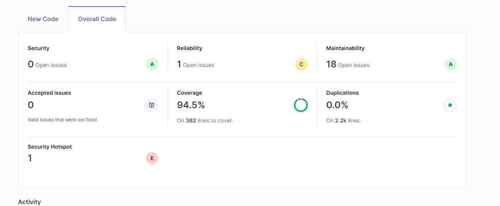

# 📅 Shift Management Module for Wellness Services

## 📌 Module Description

This module allows members of the university community (students, faculty, administrative staff, and general service personnel) to manage and view appointments for institutional wellness services: general medicine, dentistry, and psychology.
The system includes appointment scheduling via self-service tablets, administrative control by authorized personnel, and follow-up by healthcare professionals.

---

## 🛠️ Technologies Used

- **Java 17**
- **Spring Boot**
- **PostgreSQL**
- **Spring Cloud Bus**
- **JWT (JSON Web Token)**
- **Lombok**
- **Maven**
- **Swagger**

---

## 🔧 Module Functionality

### 🔗 Interaction with Other Modules

The module operates as an independent microservice, orchestrated within a microservices-based architecture and exposed through an **API Gateway** that handles authentication and request routing.

#### 🔄 General Interaction Flow:

1. **Cliente (Web/Móvil)**: Sends medical appointment requests to the **API Gateway**.
2. **API Gateway**:
    - Retrieves a JWT token from the **Auth Service**.
    - Validates the token and routes the request to the corresponding microservice.
3. **Medical Shifts Service**:
    - Verifies the user and their roles through the **Users Service**.
4. **Estadistics Service**:
    - Consumes the generated events to create historical reports and care statistics.

#### 🧩 Related Services

| Service                 | Description                                            |
|-------------------------|--------------------------------------------------------|
| **Auth Service**        | Authentication and issuance of JWT tokens              |
| **API Gateway**         | Routing and access control                             |
| **Users Service**       | User consultation and validation                       |
| **Estadistics Service** | Historical record and report generation                |

#### 🔗 Microservices Diagram


### 🏗️ Architectural Style

You can consult the complete document [here](https://pruebacorreoescuelaingeduco-my.sharepoint.com/:w:/g/personal/daniel_dcamelo_mail_escuelaing_edu_co/ETpyb_BfbnxAsZGTGKw-IB4BxNGzTujCry-kpqriQQOVgA?e=fh9OXx).


### ⚙️ Funcionamiento Interno

The **MOD-LLL-001: Medical Shift Module** exposes a RESTful API for managing the creation, viewing, and modification of appointments. It uses JWT-based authentication and distributed events for communication between services. It includes integration with tablets for physical appointment assignment and visual modules for service screens.

> 🔍 _More details available in the requirements analysis document._

[Requirements Analysis](https://pruebacorreoescuelaingeduco-my.sharepoint.com/:w:/g/personal/carlos_barrero-v_mail_escuelaing_edu_co/EVjHuij2CCpHqRy6PnCIZLUBxCcG4ULBVNxOfr0nmDv_Gw?e=ZSCGES)

---

## 📊 System Diagrams

- [ ] Class Diagram


The class diagram represents the main entities involved in shift management in the context of university welfare.
Each class encapsulates specific attributes and relationships to reflect the behavior and structure of the system.

### Main Classes

### `User`

- Represents the users who can request appointments.
- **Attributes**: `id`, `name`, `role`**Relationships**: It has a relationship with the `Turn` class as a patient.

### `Turn`

- Contains information on assigned or requested shifts.
- **Attributes**: `id`, `code`, `date`, `levelAttention`, `priority`, `speciality`, `status`, `dateAttention`
- **Relationships**:
  - A `User` who requests the turn.

### `UniversityWelfare`

- Contains settings related to shift availability.
- **Attributes**: `id`, `disableTurns`
- **Relationships**: It has a relationship with the `DisableTurnsBySpeciality` class.

### `DisableTurnsBySpeciality`
- Contains settings related to shift availability by specialty.
- **Attributes**: `speciality`
- **Relationships**: It has a relationship with the `UniversityWelfare` class.

### `Multimedia`

- Manages informative content related to the service.
- **Attributes**: `id`, `name`, `type`, `url`, `duration`

### `SpecialitySequence`

- Keeps track of the sequential numbering of shifts by specialty.
- **Attributes**: `id`, `speciality`, `sequence`

Astha Class Diagram: [Astha Class Diagram](<assets/docs/Class-diagrams.asta>)

- [ ] Component Diagram


The following component diagram demonstrates the complete flow and functional structure of the *MedicalTurns* system, covering everything from the user interface to integration with external services.

- [ ] Connection with statistics service


The raw data is sent and returned processed.

- [ ] Connection with auth service


Generates the token which will be used by our module for its validation and management of permissions by role

### Main Components

### `UniversityWelfareService`

- It is responsible for managing shifts, including their creation and updating.

### `ReportService`

- Collects and sends the data necessary for statistical analysis.
- This information is processed by the external service `bismuth-statistics-service`, which generates the statistics
when requested.

### `MultimediaService`

- Manages the module's multimedia elements, such as images and videos.
- Relies on the `MultimediaController` to expose these resources through the API.

- [ ] Sequence Diagram

[Sequence Diagram](<assets/docs/Sequence-Diagrams.pdf>)

This section documents the various **sequence diagrams** that describe the interaction between system components over time, specifically in the key flows defined for each functional module. These diagrams are essential for visualizing how the various services, controllers, and entities collaborate to fulfill the defined use cases.

### Organization of Diagrams

Sequence diagrams are organized in folders under the `sequence-diagrams` directory, according to the functional and technical modules of the system. The structure follows the **layered architecture** pattern:

- `controller/`: Contains diagrams focused on interactions at the API and HTTP controller levels.
- `service/`: Contains diagrams detailing the business logic and how the system's internal services manage processes.

Each subfolder within `controller` and `service` corresponds to a specific module of the system:

- `multimedia-controller` and `multimedia-service`
They document the workflows related to uploading, querying, and validating multimedia files associated with medical appointments or users.

- `report-controller`
Contains diagrams representing the communication between the main system and the external statistics and reporting module, as well as the display of that data to the user.

- `university-welfare-controller` and `university-welfare-service`
Represent operations related to university welfare, including social assistance flows or student tracking.

- `turn-service`
Includes diagrams for managing medical shifts, such as assignment, completion (due to attendance or non-attendance), and availability queries.

---

These diagrams provide a clear understanding of system behavior at runtime and are a useful tool for both developers and functional analysts.

- [ ] Data Diagram


The system uses a relational database (**PostgreSQL**) whose model represents the key entities involved in shift management within the context of university wellness.

The main tables and their purposes are described below:

### `app_user`

Represents the system's users (such as students or administrative staff).
Although the overall system has a centralized authentication module, this microservice stores the `app_user` table locally to avoid direct dependencies, ensuring the service's autonomy and resilience, in accordance with microservices design principles.

### `turn`

Records appointments requested by users, including attributes such as:

- Code
- Date
- Date attention
- Level attention
- Priority
- Specialty
- Status

Each shift is associated with a user.

### `university_welfare`

Defines the general settings for the university wellness service, including whether *shifts are enabled or disabled*.

### `disable_turns_speciality`

Relates specialties to wellness services that have **disabled shifts**.
This table allows you to represent multiple disabled specialties per wellness instance, addressing the
limitation of relational databases regarding list storage.

### `multimedia`

Stores informative content such as **videos or images** related to the service. It includes attributes such as:

- Duration
- Name
- Type
- URL

### `speciality_sequence`

It maintains **sequential numbering by specialty**, allowing you to assign a shift number sorted by type of medical care.

---

## 🚀 Module Features

### 📡 Endpoints REST

You can consume the already deployed API by accessing its online documentation:

- **Swagger in Azure:**

```
https://diamante-medicalturns-develop-dvb8c2cqfbh4gwbg.canadacentral-01.azurewebsites.net/swagger-ui/index.html
```  

### 😊 Happy Path

| Scenario                            | Expected Result                                                          |
| ----------------------------------- | ------------------------------------------------------------------------ |
| Create a new appointment            | The appointment is registered and the created appointment is returned    |
| Get list of available appointments  | An updated list of appointments is returned                              |
| Delete an existing appointment      | The appointment is deleted successfully and the operation is confirmed   |
| Query appointments by specific date | A list of appointments for the given date is returned                    |
| Query appointments by specific user | A list of appointments assigned to the user is returned                  |
| Query appointments by specialty     | A list of appointments filtered by specialty is returned                 |
| Enable appointments                 | The appointments are enabled and confirmation is returned                |
| Disable appointments                | The appointments are disabled and confirmation is returned               |
| Get the last called appointment     | The last called appointment is returned                                  |
| Get pending appointments            | A list of pending appointments is returned                               |
| Upload new multimedia file          | The file is successfully uploaded and the created multimedia is returned |
| List all multimedia files           | A list of all multimedia items is returned                               |
| Get the latest multimedia item      | The most recent multimedia item is returned                              |
| Get multimedia by ID                | The multimedia item corresponding to the ID is returned                  |
| Delete multimedia by ID             | The multimedia item is deleted and the action is confirmed               |
| Disable appointments by specialty   | Appointments for the specified specialty are disabled                    |
| Enable appointments by specialty    | Appointments for the specified specialty are enabled                     |

### 🚨 Error Handling

| Code | Error Message                | Probable Cause                 |
| ---- | ---------------------------- | ------------------------------ |
| 400  | "Invalid input data"         | Failed validations in the form |
| 401  | "User not authenticated"     | Invalid or missing token       |
| 404  | "Appointments not available" | Appointments are disabled      |
| 404  | "Specialty not available"    | Specialty is disabled          |
| 500  | "Internal server error"      | Unexpected failure             |
---

## 🧪 Evidence of Tests

- Evidence of coverage:

As part of software quality assurance, automated tests were performed to validate the correct functioning of the developed components. To measure the scope of these tests, JaCoCo (Java Code Coverage) was used, a tool that analyzes the percentage of source code executed during test execution.

Additionally, SonarQube was integrated to provide a more comprehensive analysis of the code's status, including coverage metrics, technical debt, code duplication, and compliance with best practices. Thanks to these tools, test coverage of over 90% was maintained, indicating a high level of automated validation of the system's code.

This level of coverage not only reflects an effort to ensure software reliability but also facilitates future project maintenance by reducing the likelihood of errors in already implemented features.

- JaCoCo Coverage Evidence:

 

- SonarQube Coverage Evidence:

 

- The tests are located at:  
  `src/test/java/eci/cvds/ecibeneficio/diamante_medicalturns_service`

- Technologies used:
    - **JUnit 5**
    - **Mockito**
    - **Spring Boot Test**
    - **SonarQube**

### ▶️ Run tests:

```bash
mvn test
```

---

## ▶️ Instructions for Executing the Project

### 🚀 Locally

1. **Clone the repository:**

```bash
git clone https://github.com/ECIBienestar/diamante-medicalturns-service.git
```

2. **Navigate to the root of the project:**

```bash
cd diamante_medicalturns_service
```

3. **Run the service with Maven:**

```bash
./mvnw spring-boot:run
```

4. **Access the local Swagger:**

```
http://localhost:8080/swagger-ui.html
```

---

## 🚀 CI/CD and Deployment Evidence

- The project is deployed in Azure.  
  👉 [Deployment for testing](diamante-medicalturns-develop-dvb8c2cqfbh4gwbg.canadacentral-01.azurewebsites.net)  
  👉 [Deployment to production](diamante-medicalturns-dzdja4b4bfayaqdk.canadacentral-01.azurewebsites.net)
- Configured pipelines:
  - GitHub Actions for testing and builds
  - Azure Pipelines for automatic deployment

---

## 🗂️ Project Structure

```
C:.
├───.github
│   └───workflows
├───.mvn
│   └───wrapper
├───assets
│   ├───docs
│   └───imgs
│       ├───diagrams
│       ├───sequence-diagrams
│       │   ├───controller
│       │   │   ├───multimedia-controller
│       │   │   ├───report-controller
│       │   │   └───university-welfare-controller
│       │   └───service
│       │       ├───multimedia-service
│       │       ├───turn-service
│       │       └───university-welfare-service
│       └───test
├───src
│   ├───main
│   │   ├───java
│   │   │   └───eci
│   │   │       └───cvds
│   │   │           └───ecibeneficio
│   │   │               └───diamante_medicalturns_service
│   │   │                   ├───config
│   │   │                   │   └───initializer
│   │   │                   ├───controller
│   │   │                   ├───dto
│   │   │                   │   ├───request
│   │   │                   │   └───response
│   │   │                   ├───exception
│   │   │                   ├───factory
│   │   │                   │   └───impl
│   │   │                   ├───model
│   │   │                   │   └───enums
│   │   │                   ├───repository
│   │   │                   │   └───projection
│   │   │                   ├───service
│   │   │                   │   └───impl
│   │   │                   └───utils
│   │   │                       ├───enums
│   │   │                       └───mapper
│   │   └───resources
│   └───test
│       └───java
│           └───eci
│               └───cvds
│                   └───ecibeneficio
│                       └───diamante_medicalturns_service
│                           ├───config
│                           │   └───initializer
│                           ├───controller
│                           ├───exception
│                           ├───factory
│                           ├───model
│                           └───service
└───target
    ├───classes
    │   └───eci
    │       └───cvds
    │           └───ecibeneficio
    │               └───diamante_medicalturns_service
    │                   ├───config
    │                   │   └───initializer
    │                   ├───controller
    │                   ├───dto
    │                   │   ├───request
    │                   │   └───response
    │                   ├───exception
    │                   ├───factory
    │                   │   └───impl
    │                   ├───model
    │                   │   └───enums
    │                   ├───repository
    │                   │   └───projection
    │                   ├───service
    │                   │   └───impl
    │                   └───utils
    │                       ├───enums
    │                       └───mapper
    ├───generated-sources
    │   └───annotations
    ├───generated-test-sources
    │   └───test-annotations
    |
    └───test-classes
        └───eci
            └───cvds
                └───ecibeneficio
                    └───diamante_medicalturns_service
                        ├───config
                        │   └───initializer
                        ├───controller
                        ├───exception
                        ├───factory
                        ├───model
                        └───service

```

---

## 📝 Code Documentation

All source code is documented via JavaDoc:

- 📘 **Classes** documented with their purpose.
- 🔧 **Methods** described with inputs, outputs and behavior.
- 🧩 **Properties** explained according to their function within the model.
