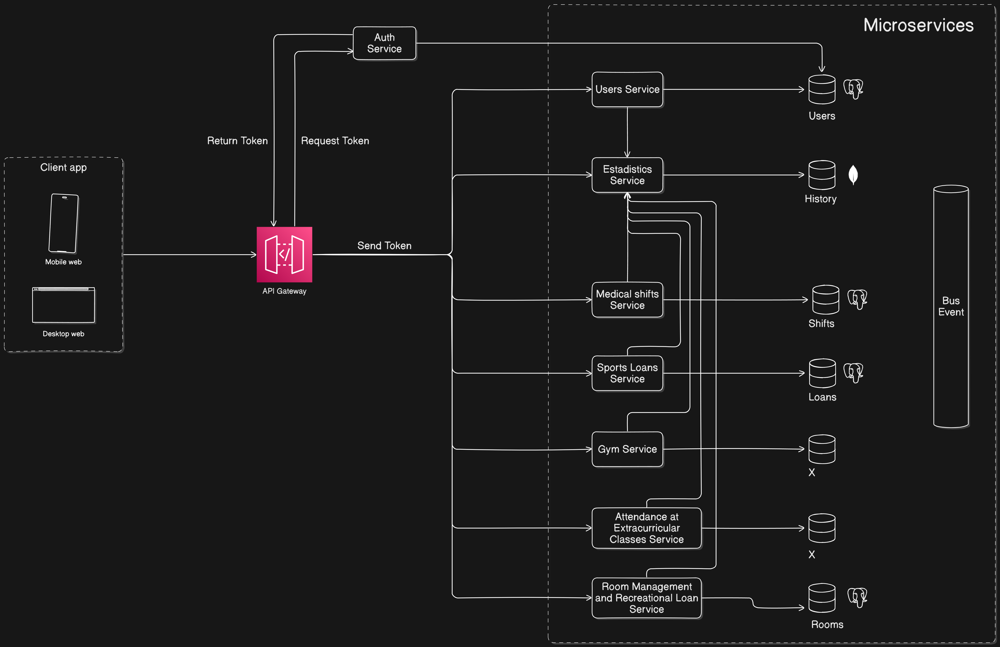

# 📅 Módulo de Gestión de Turnos para Servicios de Bienestar

## 📌 Descripción del Módulo

Este módulo permite a los miembros de la comunidad universitaria (estudiantes, docentes, administrativos y personal de servicios generales) gestionar y visualizar turnos para atención en los servicios de bienestar institucional: medicina general, odontología y psicología.  
El sistema contempla la asignación de turnos desde tablets de autoservicio, control administrativo por parte del personal autorizado y seguimiento por parte de los profesionales de la salud.

---

## 🛠️ Tecnologías Utilizadas

- **Java 17**
- **Spring Boot**
- **PostgreSQL**
- **Apache Kafka**
- **Spring Cloud Bus**
- **JWT (JSON Web Token)**
- **Lombok**
- **Maven**

---

## 🔧 Funcionamiento del Módulo

### 🔗 Interacción con Otros Módulos

El módulo opera como un microservicio independiente, orquestado dentro de una arquitectura basada en microservicios y expuesto mediante un **API Gateway** que gestiona la autenticación y el enrutamiento de peticiones.

#### 🔄 Flujo General de Interacción:

1. **Cliente (Web/Móvil)**: Envía solicitudes para turnos médicos al **API Gateway**.
2. **API Gateway**: 
   - Obtiene un token JWT desde el **Auth Service**.
   - Valida el token y enruta la petición al microservicio correspondiente.
3. **Medical Shifts Service**:
   - Verifica el usuario y sus roles a través del **Users Service**.
   - Procesa la solicitud, registra la información en su base de datos y emite eventos al **Bus de Eventos**.
4. **Estadistics Service**:
   - Consume los eventos generados para generar reportes históricos y estadísticas de atención.

#### 🧩 Servicios Relacionados

| Servicio             | Descripción                                               |
|----------------------|-----------------------------------------------------------|
| **Auth Service**     | Autenticación y emisión de tokens JWT                    |
| **API Gateway**      | Enrutamiento y control de acceso                          |
| **Users Service**    | Consulta y validación de usuarios                         |
| **Estadistics Service** | Registro histórico y generación de reportes              |
| **Event Bus**        | Middleware de eventos asincrónicos (Kafka + Cloud Bus)    |

#### 🔗 Diagrama de microservicios


### 🏗️ Estilo Arquitectónico
[DOCUMENTO DE ARQUITECTURA BACKEND](<assets/docs/DOCUMENTO DE ARQUITECTURA BACKEND.pdf>)

### ⚙️ Funcionamiento Interno

El **MOD-LLL-001: Módulo de Turnos Médicos** expone una API RESTful para gestionar la creación, consulta y modificación de turnos. Utiliza autenticación basada en JWT y eventos distribuidos para la comunicación entre servicios. Incluye integración con tablets para asignación física de turnos y módulos visuales para pantallas de atención.

> 🔍 *Más detalles disponibles en el documento de análisis de requerimientos.*

[Análisis Requerimientos](<assets/docs/Análisis Requerimientos.pdf>)

---

## 📊 Diagramas del Sistema

- [ ] Diagrama de Clases


Astha Diagrama de clases: [Astha Diagrama de clases](<assets/docs/diamante_medicalturns_service - Diagrama de clases.asta>)

- [ ] Diagrama de Componentes
1. Turn Management Service

2. Multimedia Management Service

3. Report Service

4. Notification Service


- [ ] Diagrama de Secuencia
> Aun por Definir

- [ ] Diagrama de Datos

---

## 🚀 Funcionalidades del Módulo

### 📡 Endpoints REST

| Método | Endpoint                         | Descripción                                      | Entrada                    | Salida                        |
|--------|----------------------------------|--------------------------------------------------|-----------------------------|-------------------------------|
| GET    | `/turns`                         | Lista turnos disponibles                        | N/A                         | Lista de turnos              |
| POST   | `/turns`                         | Crear nuevo turno                               | Objeto JSON del turno        | Turno creado                 |
| DELETE | `/turns/{id}`                    | Eliminar turno por ID                           | ID del turno                 | Confirmación                 |
| GET    | `/turns/{date}`                  | Lista turnos en una fecha específica            | Fecha que se quiera revisar  | Lista de turnos              |
| GET    | `/turns/{user}`                  | Lista de turnos para un usuario específico      | UserDto                      | Lista de turnos              |
| GET    | `/turns/{specialty}`             | Lista de turnos por especialidad                | Especialidad que se quiera revisar | Lista de turnos      |
| POST   | `/turns/enable`                  | Habilita los turnos                             | N/A                         | Confirmación                 |
| POST   | `/turns/disable`                 | Deshabilita los turnos                          | N/A                         | Confirmación                 |
| GET    | `/turns/lastTurn`                | Devuelve el último turno llamado                | N/A                         | Último turno llamado         |
| GET    | `/turns/pendientTurns`           | Devuelve todos los turnos que están pendientes  | N/A                         | Lista de turnos pendientes   |
| POST   | `/multimedia/{multimedia}`       | Sube un nuevo archivo multimedia                | MultimediaDTO                | Elemento multimedia creado   |
| GET    | `/multimedia`                    | Devuelve una lista de todos los elementos multimedia subidos | N/A          | Lista de elementos multimedia |
| GET    | `/multimedia/latest`             | Devuelve el último elemento multimedia          | N/A                         | Elemento multimedia          |
| GET    | `/multimedia/{id}`               | Devuelve un elemento multimedia por su ID       | ID del elemento multimedia   | Elemento multimedia          |
| DELETE | `/multimedia/{id}`               | Elimina un elemento multimedia por su ID        | ID del elemento              | Confirmación                 |
| POST   | `/turns/disable/{specialty}`     | Deshabilita turnos de una especialidad específica | Especialidad específica    | Confirmación                 |
| POST   | `/turns/enable/{specialty}`      | Habilita turnos de una especialidad específica  | Especialidad específica      | Confirmación                 |


### 😊 Happy Path

| Escenario                                 | Resultado esperado                                    |
|-------------------------------------------|------------------------------------------------------|
| Crear un nuevo turno                      | Se registra el turno y se devuelve el turno creado    |
| Obtener lista de turnos disponibles       | Se devuelve una lista actualizada de turnos           |
| Eliminar un turno existente               | Se elimina correctamente y se confirma la operación  |
| Consultar turnos por fecha específica     | Se devuelve lista de turnos correspondientes a la fecha |
| Consultar turnos por usuario específico   | Se devuelve lista de turnos asignados al usuario      |
| Consultar turnos por especialidad         | Se devuelve lista de turnos filtrados por especialidad |
| Habilitar turnos                          | Se habilitan los turnos y se confirma la habilitación |
| Deshabilitar turnos                       | Se deshabilitan los turnos y se confirma la acción    |
| Obtener el último turno llamado           | Se devuelve el último turno que fue llamado           |
| Obtener turnos pendientes                 | Se devuelve la lista de turnos en estado pendiente    |
| Subir nuevo archivo multimedia            | Se sube correctamente el archivo y se devuelve el multimedia creado |
| Listar todos los archivos multimedia      | Se devuelve lista de todos los elementos multimedia   |
| Consultar último elemento multimedia      | Se devuelve el elemento multimedia más reciente      |
| Consultar multimedia por ID               | Se devuelve el elemento multimedia correspondiente al ID |
| Eliminar multimedia por ID                | Se elimina el elemento multimedia y se confirma la acción |
| Deshabilitar turnos de una especialidad   | Se deshabilitan turnos de la especialidad indicada    |
| Habilitar turnos de una especialidad       | Se habilitan turnos de la especialidad indicada       |


### 🚨 Manejo de Errores

| Código | Mensaje de error                 | Causa probable                         |
|--------|-----------------------------------|----------------------------------------|
| 400    | "Datos de entrada inválidos"      | Validaciones fallidas en el formulario |
| 401    | "Usuario no autenticado"          | Token inválido o ausente               |
| 404    | "Turnos no disponibles"           | Los turnos están deshabilitados        |
| 404    | "Especialidad no disponible"      | Especialidad deshabilitada             |
| 500    | "Error interno del servidor"      | Fallo inesperado                       |

---

## 📬 Uso de Colas de Mensajería

| Tópico Kafka      | Evento Disparado          | Resultado Esperado             | Happy Path                        | Dead Letter Queue (DLQ)        |
|-------------------|---------------------------|--------------------------------|------------------------------------|--------------------------------|
| x   | x               | x | x | x |

---

## 🧪 Evidencia de Pruebas

- Las pruebas están ubicadas en:  
  `src/test/java/eci/cvds/ecibeneficio/diamante_medicalturns_service`

- Tecnologías utilizadas:
  - **JUnit 5**
  - **Mockito**
  - **Spring Boot Test**

### ▶️ Ejecutar pruebas:
```bash
mvn test
```

---

## ▶️ Instrucciones para Ejecutar el Proyecto

### 🚀 De forma local

1. **Clona el repositorio:**
```bash
git clone https://github.com/ECIBienestar/diamante-medicalturns-service.git
```

2. **Navega a la raíz del proyecto:**
```bash
cd diamante_medicalturns_service
```

3. **Ejecuta el servicio con Maven:**
```bash
./mvnw spring-boot:run
```

4. **Accede al Swagger local:**
```
http://localhost:8080/swagger-ui.html
```

---

### ☁️ Usando el despliegue en Azure

Puedes consumir el API ya desplegado accediendo a su documentación en línea:

- **Swagger en Azure:**
```
https://back-medicalturns-develop-aycucpewbafjhce5.mexicocentral-01.azurewebsites.net/swagger-ui.html
```

Este endpoint se encuentra protegido por autenticación JWT, por lo que deberás obtener un token desde el **Auth Service** antes de realizar peticiones.

---

### 🌐 Ejemplo de consumo desde un Frontend en React

A continuación, se muestra un ejemplo básico de cómo consumir el endpoint `GET /turns` desde una aplicación React utilizando `fetch` y un token JWT:

---

### 📁 `api.ts` – Configuración base del cliente HTTP

```ts
// src/api.ts
export const API_URL = 'https://back-medicalturns-develop-aycucpewbafjhce5.mexicocentral-01.azurewebsites.net/';

export const fetchWithToken = async (endpoint: string, token: string, options?: RequestInit) => {
  const res = await fetch(`${API_URL}${endpoint}`, {
    ...options,
    headers: {
      'Authorization': `Bearer ${token}`,
      'Content-Type': 'application/json',
      ...(options?.headers || {}),
    },
  });

  if (!res.ok) {
    const errorText = await res.text();
    throw new Error(`Error ${res.status}: ${errorText}`);
  }

  return res.json();
};

```

---

### 📁 `services.ts` – Servicios específicos para turnos

```ts
// src/services.ts
import { fetchWithToken } from './api';

export const getTurnos = (token: string) => {
  return fetchWithToken('/turns', token);
};

export const crearTurno = (token: string, turnoData: any) => {
  return fetchWithToken('/turns', token, {
    method: 'POST',
    body: JSON.stringify(turnoData),
  });
};

```

---

## 🚀 Evidencia de CI/CD y Despliegue

- El proyecto se encuentra desplegado en Azure.
- Acceso a la API mediante Swagger:  
  👉 [Ver en Azure](https://back-medicalturns-develop-aycucpewbafjhce5.mexicocentral-01.azurewebsites.net/swagger-ui.html)
- Pipelines configurados:
  - GitHub Actions para pruebas y builds
  - Azure Pipelines para despliegue automático

---

## 🗂️ Estructura del Proyecto

```
C:.
├───.mvn
│   └───wrapper
└───src
    ├───main
    │   ├───java
    │   │   └───eci
    │   │       └───cvds
    │   │           └───ecibeneficio
    │   │               └───diamante_medicalturns_service
    │   │                   ├───controller
    │   │                   ├───model
    │   │                   ├───repository
    │   │                   └───service
    │   └───resources
    └───test
        └───java
            └───eci
                └───cvds
                    └───ecibeneficio
                        └───diamante_medicalturns_service 
```

---

## 📝 Documentación del Código

Todo el código fuente cuenta con documentación mediante JavaDoc:

- 📘 **Clases** documentadas con su propósito.
- 🔧 **Métodos** descritos con entradas, salidas y comportamiento.
- 🧩 **Propiedades** explicadas según su función dentro del modelo.

---

**📌 Nota:** Este README se actualizará conforme avance el desarrollo del proyecto.